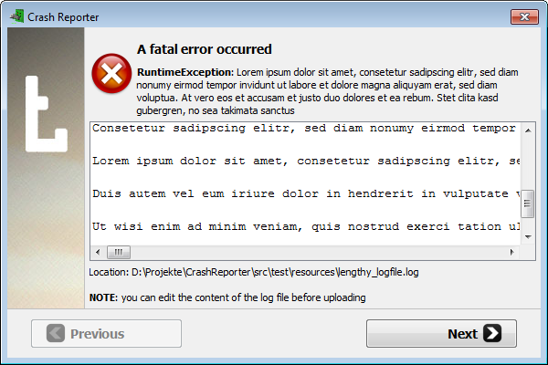

# CrashReporter 

[](http://jenkins.terasology.org/view/Ext/job/CrashReporter/)
[](../../releases/latest)
[-Apache%202.0-blue.svg)](http://www.apache.org/licenses/LICENSE-2.0)
[](https://discord.gg/terasology)

**A crash reporting tool**



It enables users to upload their game log and redirects them to different support sites.

## Publish a New Release

Publishing a new release requires to merge all changes from `develop` into `master`,
bump the version number and add a Git tag. The following steps describe how this
is done.

Be sure that your local workspace is up to date by fetching and merging from upstream
before starting the process. 
This guide assumes that you've added `movingblocks` as remote for the upstream
repository, e.g., by executing
```
git remote add movingblocks https://github.com/MovingBlocks/CrashReporter
```

### Prepare Release (branch: `develop`, local workspace)

1. Update version in `gradle.properties`, remove the SNAPSHOT suffix <br>
    e.g. `version=4.1.0`
2. Update CHANGELOG/README (if necessary)
3. Commit the changes <br>
    e.g. `git commit -m "Release 4.2.0"`
4. Create a tag for the release <br>
    e.g. `git tag -a 'v3.1.0' -m "Version 3.1.0"`
5. Merge `develop` into `master` (local workspace) <br>
    ```
    git checkout master
    git merge --ff-only develop
    ```
### Release (branch: `master`)

1. Push local `master` branch to upstream <br>
    `git push --tags movingblocks master`
2. Verify that the Jenkins job build succeeded and the new release is working
3. Close GitHub milestones or issues, if applicable

### Prepare Next Release (branch: `develop`)

1. Update version in `gradle.properties` to prepare for next release <br>
    e.g. `version=4.1.1-SNAPSHOT`
2. Update CHANGELOG/README (if necessary)
3. Commit the changes <br>
    e.g. `git commit -m "Version 4.1.1-SNAPSHOT"`
4. Push local `develop` branch to upstream <br>
    `git push --tags movingblocks develop`
5. Create new GitHub milestone, if applicable

### License

This software is licensed under the [Apache 2.0 License](http://www.apache.org/licenses/LICENSE-2.0.html).
